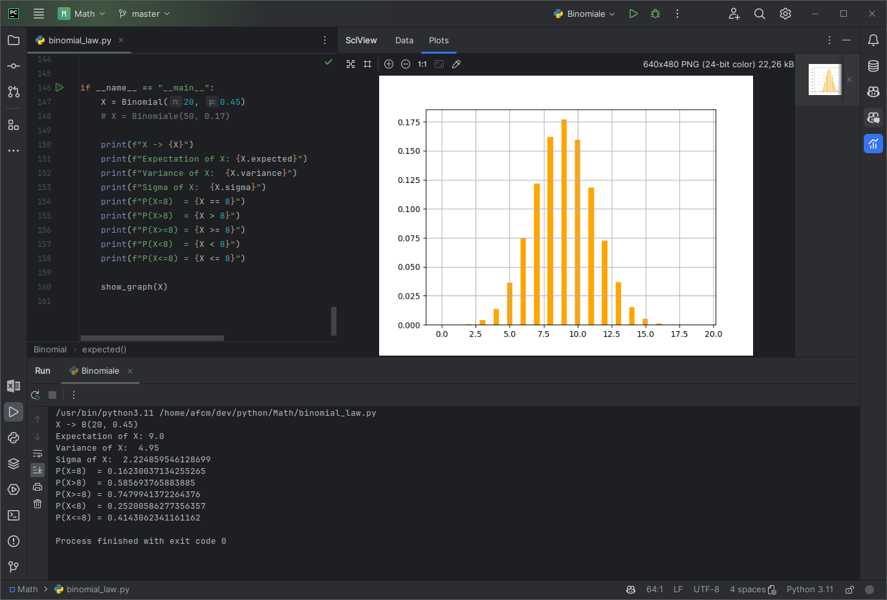

# Math Algorithms

Some algorithms I made to understand maths better.

| Name                          | Status | Tests? |
|-------------------------------|--------|--------|
| [Binomial Law](#binomial-law) | Done   | ✅      |
| [Matrix](#matrix)             | WIP    | ✅      |
| Sequences                     | WIP    | ❌      |
| Vectors                       | TODO   | ❌      |

## Binomial law

```python
from binomial_law import *

# Binomial law of parameters n = 10 and p = 0.2
X = Binomial(10, 0.2)

print(f"X -> {X}")
print(f"Expectation of X: {X.expected}")
print(f"Variance of X:  {X.variance}")
print(f"Sigma of X:  {X.sigma}")
print(f"P(X=8)  = {X == 8}")
print(f"P(X>8)  = {X > 8}")
print(f"P(X>=8) = {X >= 8}")
print(f"P(X<8)  = {X < 8}")
print(f"P(X<=8) = {X <= 8}")
```

Also provide function to visualize a law using `matplotlib.pyplot`:

```python
from binomial_law import *

X = Binomial(10, 0.2)

show_graph(X)
```



# Matrix

```python
from matrix import Matrix

A = Matrix([
	[1, 2, 3],
	[0, 4, -1],
])

assert A.size == (2, 3)
assert A.is_square == False
assert A.is_line == False
assert A.is_column == False

B = Matrix([
	[1, 0, 0],
	[0, 2, 0],
	[0, 0, 0],
])

assert B.size == (3, 3)
assert B.is_square == True
assert B.is_line == False
assert B.is_column == False

assert A * B == Matrix([
	[1, 4, 0],
	[0, 8, 0]
])

assert -A == Matrix([
	[-1, -2, -3],
	[0, -4, 1],
])

I2 = Matrix.identity(2)

O2 = Matrix.null(2)
```
